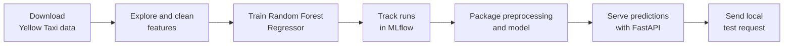

# Model Deployment Project
Avi Putri Pertiwi

01.10.2026

## Scripts

- `notebooks/01.experiments.ipynb`: Jupyter notebook for experimenting the codes
- `src/features.py`: Reusable data preparation
- `src/train.py`: Train and predict model
- `src/predict.py`: Predict model
- `src/tune.py`: Tune model parameters
- `app/main.py` and `schemas.py`: FastAPI application and prediction schema.
- `test/test_features.py`: Test the `src/features.py` script

## Results

**The RMSE of my final model**

The final RandomForestRegressor (100 trees, max_depth=20, min_samples_leaf=5) achieves a validation RMSE of **4.304** minutes, trained on the January 2025 NYC Yellow Taxi dataset after cleaning.

**What I would do differently if I have more time**

- Proper data cleaning framework since the beginning. I forgot to check and filter out the trip distance and number of passenger distribution before training the model, hence the model training became expansive and took too long to run. The running time became normal after these steps were implemented.
- Start testing the model training with smaller training data subset to ensure everything works properly, only after everything works the whole training datasets should be used
- I would add running time to the parameter tuning script to track how much time needed to optimize and rerun the best model. This can be used as a deciding factor whether or not this step is worth it for this model specifically

--------------------------------------------

# Main Tasks

## Data Cleaning

The Taxi data needed filtering before training:

- `duration_minutes` (computed from pickup/dropoff timestamps) included values ranging from -51,472 to 5,626 minutes due to clock errors. Filtered to a 1–60 minute range based on inspecting percentiles (75th percentile was ~18.3 minutes).
- `trip_distance` included values as large as 276,423 miles. Filtered to a 0–100 mile range.
- Applying these two filters dropped the baseline model's validation RMSE from ~26 minutes to ~4.3 minutes, confirming the unfiltered outliers were dominating the error metric rather than reflecting genuine model quality.

## Feature Engineering

- `PULocationID`/`DOLocationID` (263 raw zone IDs) were grouped into `PUBorough`/`DOBorough` (6-7 categories) using the NYC TLC zone lookup table, trading some location granularity for a much smaller, faster one-hot feature space (~520 columns down to ~18).
- `trip_distance` is used as a feature, which is worth flagging as a limitation: in a real pre-trip duration prediction scenario, the exact final distance wouldn't be known in advance, only an estimate. This dataset's recorded distance is a bit of a shortcut for this exercise.
- Fare/payment-related columns (fare_amount, tip_amount, etc.) were deliberately excluded as features since they're computed from the trip itself and would leak information about duration rather than genuinely predict it.

--------------------------------------------
# Stretch Tasks

## Parameter Tuning

Best parameters found:
```python
{'n_estimators': 150, 'min_samples_leaf': 2, 'max_depth': 15}
```
Tuned model validation RMSE: 4.298

The tuned model is only slightly better than the baseline: an improvement of about 0.006 minutes, which is negligible in practice.

It is possible that Random Forests tend to be fairly robust to hyperparameter choices within a reasonable range (unlike more tuning-sensitive models such as gradient boosting), and the baseline's hyperparameters were already in a reasonable operating zone.

Given the added complexity and runtime, **parameter tuning was not worth it for this baseline**. The real ceiling on model performance is more likely the limited feature set (coarse borough-level location, no traffic/weather data) than the model's hyperparameters.

## Testing
```python
tests/test_features.py::test_compute_target PASSED                                                                         [ 20%]
tests/test_features.py::test_add_time_features PASSED                                                                      [ 40%]
tests/test_features.py::test_filter_outliers_duration PASSED                                                               [ 60%]
tests/test_features.py::test_filter_outliers_distance PASSED                                                               [ 80%]
tests/test_features.py::test_impute_missing PASSED                                                                         [100%]
```


-------------------------------------------------------

(Original ReadMe below)

-------------------------------------------------------

# Model Deployment Project

Use this repository as a **template** for your model deployment project. You will train a regression model that predicts the duration of NYC Yellow Taxi trips, track your experiments locally with MLflow, and serve predictions through a FastAPI app on your own machine. Create pull requests in your own copy even if you are working alone, and use them to track your progress.

## Learning Objectives

By the end of this repository, you should be able to:

- Build an end-to-end regression workflow for real-world taxi trip data.
- Separate exploration, preprocessing, training, and serving concerns into maintainable code.
- Track experiments locally with MLflow and compare model runs.
- Serve model predictions through a local API.

## Learning Path



| File / Folder | Description |
|---|---|
| [**Project Description**](project-description.md) | The assignment tasks, suggested workflow, repository layout, and stretch goals. |

### Additional Folders and Files

| File / Folder | Description |
|---|---|
| [**pyproject.toml**](pyproject.toml) | Project configuration and dependencies. |
| [**uv.lock**](uv.lock) | Dependency lock file. |

## Setup

> [!NOTE]
> Throughout these steps, text in angle brackets like `<repo-name>` is a **placeholder**. Replace it, including the `< >` brackets, with your own value. For example, `cd <repo-name>` becomes `cd mle-model-deployment-project`.

### 1. Create the Repository from the Template

Click **Use this template** on GitHub.

When creating the repository:

- Set yourself as the **Owner**
- Choose a repository name
- Disable **Include all branches**
- Click **Create repository**

> [!IMPORTANT]
> If you are working in pairs or groups, only **one person** should complete this step.

---

### 2. Add Collaborators (Pairs/Groups Only)

If working with teammates:

1. Open the repository on GitHub
2. Go to **Settings → Collaborators**
3. Add your teammates as collaborators
4. Share the repository link with your team

Teammates should accept the invitation before continuing.

---

### 3. Clone the Repository

Copy the SSH URL from the **Code** button on GitHub, then run:

```bash
git clone <copied-ssh-url>
```

The copied SSH URL will look like `git@github.com:<your-username>/<repo-name>.git`.

---

### 4. Move into the Project Folder and Install Dependencies

This installs all dependencies and creates a virtual environment in `.venv/`.

```bash
cd <repo-name>
uv sync
```

---

### 5. Open the Project in VS Code

> [!NOTE]
> Make sure you open VS Code from the project root so it automatically detects the environment created by `uv sync`.

Launch VS Code in the project root folder:

```bash
code .
```

When you create notebooks (for example in a `notebooks/` folder), select the Python environment created by `uv sync` as the kernel.

## How to Use This Repo

1. Read the assignment brief in [project-description.md](project-description.md).
2. Download and inspect the January 2025 Yellow Taxi dataset.
3. Train a baseline `RandomForestRegressor` and track runs locally with MLflow.
4. Refactor preprocessing and training logic into reusable Python modules.
5. Build a local prediction API with FastAPI.
6. Send a test request to the API and document the outcome in your README or PR.

### Working Locally

Once you have implemented the project code, a typical local workflow looks like this:

1. Train the model and log runs to the local `mlruns/` directory with MLflow.
2. Start the tracking UI:

   ```bash
   uv run mlflow ui --backend-store-uri sqlite:///mlflow.db --port 5000
   ```

3. Run the API locally:

   ```bash
   uv run uvicorn app.main:app --reload --port 8000
   ```

4. Send a request to the API:

   ```bash
   curl -X POST http://127.0.0.1:8000/predict -H "Content-Type: application/json" -d @sample-request.json
   ```

The `app/` package and `sample-request.json` are files you create during the project. Make the sample request match your `/predict` input schema before running the commands above.
